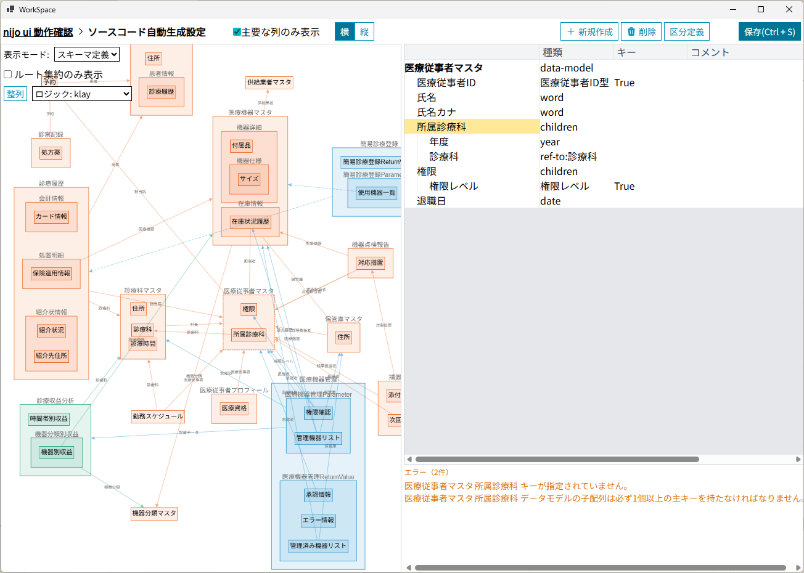

---
# https://vitepress.dev/reference/default-theme-home-page
layout: home

hero:
  name: "Nijo Application Builder"
  text: "業務システム外部仕様の合意形成プラットフォーム"
  tagline: データベース定義・画面項目定義を可視化し、関係者間の合意を高速・高精度で形成するための開発支援ツール
  actions:
    - theme: brand
      text: チュートリアル
      link: /tutorials/
    - theme: alt
      text: ハウツーガイド
      link: /how-to-guides/
    - theme: alt
      text: リファレンス
      link: /reference/
    - theme: alt
      text: 設計思想
      link: /explanation/

features:
  - title: 📊 データモデル可視化
    details: エンティティと関係性を直感的なダイアグラムで表現し、複雑なデータ構造を分かりやすく整理
  - title: ⚡ リアルタイム編集
    details: Webベースのインターフェースで即座に変更を反映
  - title: 🔗 関係性管理
    details: 複雑なデータ関係も分かりやすく整理・表示し、影響範囲を明確に把握
  - title: ✅ 合意形成支援
    details: 技術者と非技術者の間で共通の理解基盤を構築し、外部仕様の合意を高速・高精度で形成
---

## 概要

NijoApplicationBuilderは、業務システムの外部仕様について関係者間の合意を高速・高精度で形成するためのプラットフォームです。データベース定義や画面項目定義を直感的に可視化し、ステークホルダー間のコミュニケーションを円滑にします。

### 主な価値

- **合意形成の高速化**: 複雑なデータモデルの関係性を可視化し、関係者間の理解を促進
- **仕様の高精度化**: データベース定義と画面項目定義の整合性を保ち、仕様の齟齬を防止
- **コミュニケーション改善**: 技術者と非技術者の間で共通の理解基盤を構築
- **開発効率向上**: 外部仕様の合意が取れた状態から開発を開始し、手戻りを最小化

### 対象業務システム

勤怠管理、受注管理、生産管理など、複数のステップの業務フローから構成され、複数の関係者が協働して進める業務のシステムの外部仕様設計に特化しています。

## 典型的な利用シーン

- **要件定義フェーズ**: 顧客との要件合意を可視的に行う
- **設計レビュー**: 開発チーム内でのデータモデル設計合意
- **変更管理**: 仕様変更の影響範囲を可視化し、関係者と合意形成

## ドキュメントの構成
どこから始めればよいかわからない場合はチュートリアルから読み始めてください。

- **📚 [チュートリアル](/tutorials/)** - 基本的な機能を試し、このアプリケーションができることを理解します。
- **🛠️ [How-to ガイド](/how-to-guides/)** - 特定のタスクを達成する実践的な方法。データモデル設計、関係性の可視化、関係者との合意形成など
- **📖 [リファレンス](/reference/)** - 技術仕様と詳細情報。UI操作、データ型、モデル定義、システム連携の完全なリファレンス
- **💡 [設計思想](/explanation/)** - 概念と設計思想を理解する。なぜ外部仕様の合意形成が重要なのか、アーキテクチャの設計思想を深く理解
