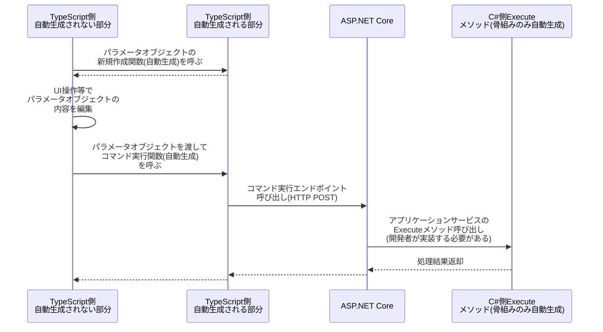

# CommandModel コマンドモデル
スキーマ定義での指定方法: '{{SchemaName}}'

アクター（このアプリケーションのユーザまたは外部システム）がこのアプリケーションの状態や
このアプリケーションのDataModelに何らかの変更を加えるときの操作のデータの形。
基本的にはコマンドが実行されるとDataModelに何らかの変更がかかるが、
DataModelに何の変更も加えないCommandModelも許容される。（例えば、Excel出力のようなダンプ処理など）

CQS, CQRS における Command とほぼ同じ。
QueryModel とは対の関係にある。（CommandModelはアクターからDataModelへのデータの流れ、QueryModelはDataModelからアクターへのデータの流れ）

CommandModelの集約1件からは以下のモジュールが生成される。

## コマンド処理
このコマンドを実行するためのAPIが生成される。
コマンド処理のデータフローは以下。



## 重要な特性
* CommandModelではC#側の処理の主要な内容は一切自動生成されず、すべて開発者が実装する必要がある
  * Executeメソッド内の実装はすべて開発者の責任となる
  * DataModelの更新・参照や、他システムとの連携処理などはすべて開発者が実装する
* CommandModelではパラメータの形も戻り値の形も両方ともスキーマ定義で指定する
  * Parameter子集約がコマンドへの入力パラメータとなる
  * ReturnValue子集約がコマンドからの戻り値となる

## パラメータクラス（Parameter）
コマンドのパラメータオブジェクトは、スキーマ定義で「xxxxxParameter」という物理名を持つ子集約として定義する。
このパラメータオブジェクトの構造がそのままC#とTypeScriptの型として生成される。

```ts
type とあるCommandのParameter型 = {
  /** スキーマ定義で指定された項目がパラメータの項目として自動的に生成される */
  入力項目その1?: string
  入力項目その2?: number

  /** 子集約がある場合はネストした形になる */
  子パラメータ: {
    子の入力項目1?: string
    子の入力項目2?: number
    // 以下略...
  }

  /** 配列の子集約も定義可能 */
  明細パラメータ: {
    明細の入力項目1?: string
    明細の入力項目2?: number
    // 以下略...
  }[]

  // 以下略...
}
```

## 戻り値クラス（ReturnValue）
コマンドの戻り値オブジェクトは、スキーマ定義で「xxxxxReturnValue」という物理名を持つ子集約として定義する。
この戻り値オブジェクトの構造がそのままC#とTypeScriptの型として生成される。

```ts
type とあるCommandのReturnValue型 = {
  /** スキーマ定義で指定された項目が戻り値の項目として自動的に生成される */
  結果項目その1?: string
  結果項目その2?: number

  /** 子集約がある場合はネストした形になる */
  子結果: {
    子の結果項目1?: string
    子の結果項目2?: number
    // 以下略...
  }

  /** 配列の子集約も定義可能 */
  明細結果: {
    明細の結果項目1?: string
    明細の結果項目2?: number
    // 以下略...
  }[]

  // 以下略...
}
```

## TypeScriptによる開発補助のための関数等
* コマンド実行をJavaScriptから呼び出すための関数。およびそのリクエストを受け付けるためのASP.NET Core Controller Action。
* パラメータオブジェクトを新規作成する関数

## メタデータ
スキーマ定義で指定された、項目ごとの文字列長や桁数や必須か否かなどの情報自体をプロジェクトで使用したい場合に使う。
主にReact Hook Form や zod のようなバリデーション機能をもったライブラリで使用されるような使い方を想定。
C#, TypeScript それぞれで生成される。

## オプション
この集約の属性に指定することができるオプションは [こちら](./CommandModel.Options.md) を参照のこと。
