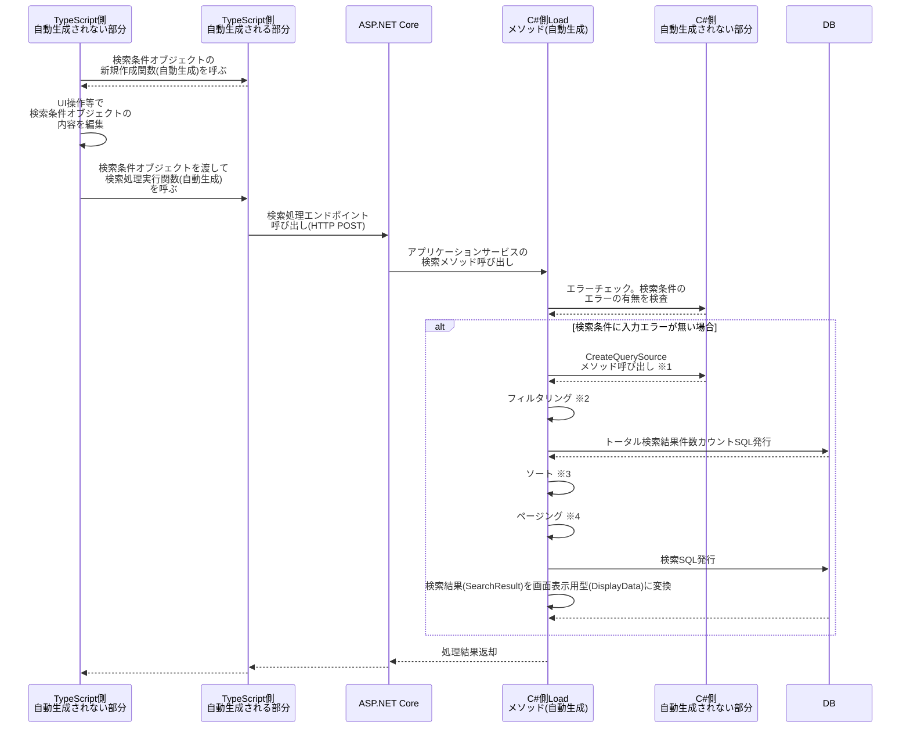

# QueryModel クエリモデル
スキーマ定義での指定方法: `query-model`

アクター（このアプリケーションのユーザまたは外部システム）が、アプリケーションに蓄積されたデータ（DataModel）を、特定の観点から参照するためのデータの形。
CQS, CQRS におけるクエリとほぼ同じもの。
CommandModel とは対の関係にある。
（CommandModel はアクターから DataModel へのデータの流れ、QueryModel は DataModel からアクターへのデータの流れ）

QueryModelの集約1件からは以下のモジュールが生成される。

## 検索処理
このクエリモデルを一覧検索するためのAPIが生成される。
検索処理のデータフローは以下。



※1: 開発者はここでDbContextを用いて任意のテーブルからQuerySourceを作成する。
※2: 検索条件とQuerySourceを突き合わせて自動的にWhere句が生成される。完全一致・範囲検索といったフィルタリングの挙動はValueMemberの種類によって定義される。
※3: 検索条件オブジェクトは「xxx項目（昇順）」「xxx項目（降順）」といった、どの項目でソートを行なうかの情報を複数持っている。ここでその情報を先頭から順番に適用していく。
※4: 検索条件オブジェクトは、検索結果のうち先頭から何件をスキップしてその次の何件を取得するかの情報を持っているため、ここでそれを適用する。

QueryModelでは、自身の集約やその子孫集約を再帰的に参照するような循環参照は許可されていません。
このようなスキーマ定義はバリデーションエラーとなります。

## 検索条件クラス（SearchCondition）
検索条件オブジェクトは以下の構造を持つ。ここではTypeScriptで記載しているが、C#側のクラスの構造も全く同じ。

```ts
type とあるQueryModelの検索条件型 = {
  /** スキーマ定義で指定された項目ごとに検索条件の項目が自動的に生成される。 */
  filter: {
    // 文字列項目の場合、それが部分一致か完全一致か等はスキーマ定義で指定する。
    文字列項目その1?: string

    // 日付項目や時間に関係する項目は範囲検索となる。
    数値項目その2?: { from?: number, to?: number }

    // フラグ項目はtrueのみ抽出するかfalseのみを抽出するかを指定する。
    フラグ項目その3?: { trueのみ?: boolean, falseのみ?: boolean }

    // 列挙体項目は、各列挙体メンバーの表示名をキーとし、boolean を値とするオブジェクトで指定する。
    とある列挙体項目?: { 'メンバーA'?: boolean, 'メンバーB'?: boolean, 'メンバーC'?: boolean }

    // 参照先の項目による検索も可能。
    参照先の項目: {
      参照先の属性1?: string
      参照先の属性2?: string
      // 以下略...
    }

      // 以下略...
}

  /** ソート条件。スキーマ定義で指定された項目ごとにソート条件の項目が自動的に生成される。複数指定でき、先頭から順番に適用される。 */
  sort: (
    '文字列項目その1（昇順）' |
    '文字列項目その1（降順）' |
    '数値項目その2（昇順）' |
    '数値項目その2（降順）' |
    // ...以下略
  )[]

  // ページング用の条件。
  skip?: number
  take?: number
}
```

## 検索結果クラス（SearchResult）
データベースに対する問い合わせの形。
前述のシーケンス図で言うと※1のクエリソース作成から「画面表示用データに変換」までの処理がこの形のクラスで取り回される。
パフォーマンスで問題が出たときにSQLでチューニングしやすいようにするため、フラットなデータ構造をもつ。

## 画面表示用型（DisplayData）
画面表示用のオブジェクト。
開発者がこのオブジェクトを用いた登録処理を記述しやすいようにするための構造になっている。
DisplayDataの構造は以下。（TypeScriptで記載しているが、C#側も全く同じ構造を持つ）

```ts
type とある集約のDisplayData = {
  /** このオブジェクト自身の値（スキーマ定義で指定された項目） */
  values: {
    項目その1?: string
    項目その2?: number
    // 以下略...
  }
  /** 画面表示用オブジェクトの読み取り専用情報 */
  readOnly: {
    /** 特定の項目だけでなくこのオブジェクト全体が読み取り専用か否か */
    allReadOnly: boolean

    // スキーマ定義で指定された項目ごとに、その項目が読み取り専用か否か
    項目その1?: boolean
    項目その2?: boolean
    // 以下略...
  }
  /** このオブジェクトがデータベースから読み込まれたデータか否か */
  existsInDatabase: boolean
  /** このオブジェクトが画面表示中に何らかの変更を加えられたか否か */
  willBeChanged: boolean
  /** このオブジェクトが更新確定時に削除されるか否か */
  willBeDeleted: boolean
  /** 楽観排他制御に用いられる、画面表示時点のバージョン番号 */
  version?: number

  // このオブジェクトが子や子配列を持つ場合、直下の子要素のDisplayDataを持つ。
  子要素その1: とある集約の子のDisplayData
  とある明細A: とある集約の明細のDisplayData[]
  // 以下略...
}
```

## 参照検索（RefSearch）
このQueryModelの集約が他のQueryModelから参照される場合に、このQueryModelの集約を参照するためのAPIが生成される。

スキーマ定義では `ref-to` を用いて参照先のQueryModelを指定するが、集約ルートだけでなく、その集約の子孫集約も参照先に指定できる。
そのため、通常の検索処理のエンドポイントはルート集約のみに対して生成されるが、
参照検索のエンドポイントはそのルート集約の子孫集約に対しても生成される。

なお、スキーマ定義で他のどの集約からも `ref-to` されていない集約は、
その集約の参照検索関連のコードは生成されない。

以下について、通常のDisplayDataなどと異なる参照検索用のクラスや関数が生成される。

### 検索処理（SearchProcessingRef）
参照検索処理は、通常の検索処理を援用して実装される。
前述のシーケンス図で言うと、検索結果(SearchResult)を画面表示用型(DisplayData)に変換する直前までは通常の検索処理と同じである。
その後、画面表示用型(DisplayData)に変換する際に、SearchResultをDisplayDataに変換するのではなく、DisplayDataRefに変換する。

### 検索条件（SearchCondition）
通常のSearchConditionと同じ。
なお、 `ref-to` されている集約がルートではなく子孫集約の場合、当該子孫のルートの検索条件オブジェクトになる。

```ts
// 参照されている方のSearchCondition
type 集約AのSearchCondition = {
  filter: {
    親のID?: string
    親の名前?: string
    集約AのChildren: {
      子のID?: string
      子の金額?: { from?: number, to?: number }
      子の日付?: { from?: string, to?: string }
      // 以下略...
    }
  }
  // 以下略...
}

// 参照する方のSearchCondition
type 集約BのSearchCondition = {
  filter: {
    参照元の集約のID?: string
    参照元の集約の金額?: { from?: number, to?: number }
    参照元の集約の日付?: { from?: string, to?: string }

    // 「集約AのChildren」ではなく集約Aのルートの検索条件がここにすべて現れる
    集約AのChildrenへの参照: {
      親のID?: string
      親の名前?: string
      集約AのChildren: {
        子のID?: string
        子の金額?: { from?: number, to?: number }
        子の日付?: { from?: string, to?: string }
        // 以下略...
      }
    }
  }
  // 以下略...
}
```

### 画面表示用データ（DisplayDataRef）
参照元のDisplayDataのvaluesの中に、参照先のDisplayDataRefが入る形になる。

```ts
type 他の集約から参照されている集約AのDisplayDataRef = {
  集約AのID?: string
  集約Aの名前?: string
  // 以下略...
}

type 参照元集約BのQueryModelのDisplayData = {
  values: {
    参照元集約BのID?: string
    参照元集約Bの名前?: string

    // 参照元のオブジェクトのvaluesの中に、参照先の集約AのDisplayDataRefが入る
    RefTo集約A?: 他の集約から参照されているデータのDisplayDataRef
  }
  // 以下略...
}
```

## TypeScriptによる開発補助のための関数等
- 検索処理をJavaScriptから呼び出すための関数。およびそのリクエストを受け付けるためのASP.NET Core Controller Action。
- 検索条件オブジェクトや画面表示用オブジェクトを新規作成する関数
- 画面表示用オブジェクトのディープイコール比較関数

## 画面表示用データ(DisplayData)のメタデータ
スキーマ定義で指定された、項目ごとの文字列長や桁数や必須か否かなどの情報自体をプロジェクトで使用したい場合に使う。
主にReact Hook Form や zod のようなバリデーション機能をもったライブラリで使用されるような使い方を想定。
C#, TypeScript それぞれで生成される。

## オプション
この集約の属性に指定することができるオプションは [こちら](./QueryModel.Options.md) を参照のこと。
