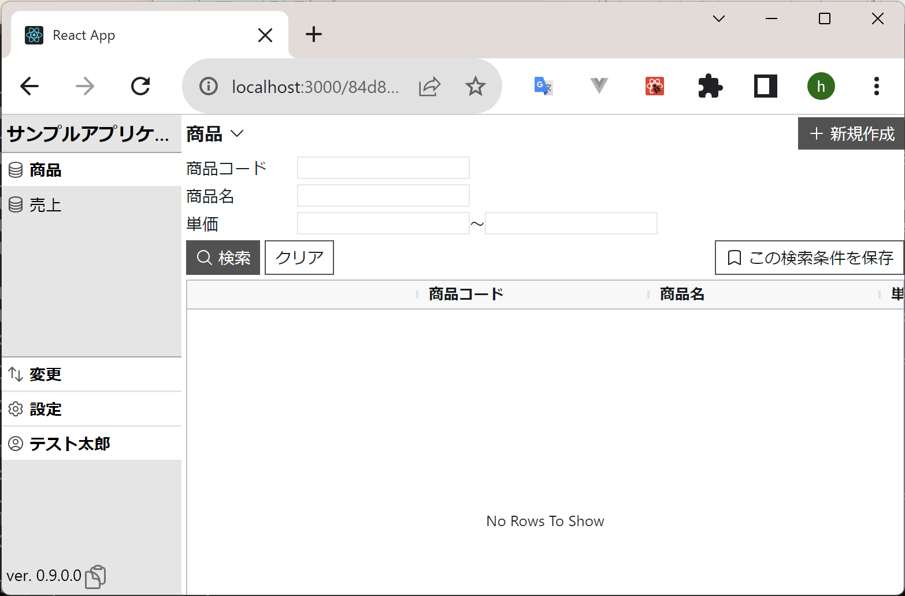
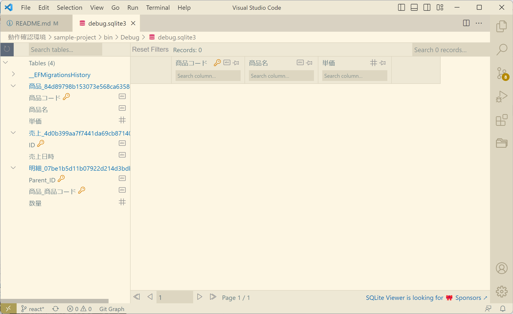

# HalApplicationBuilder
データモデルを指定すると以下のものを作成してくれるローコードアプリケーション作成ツール。
- RDB定義（EntityFrameworkCore）
- WebAPI（ASP.NET Core Web API）
- GUI（React）

## :cherry_blossom: 特徴
### データ構造を定義するだけで、データベース定義や、それなりの画面を自動生成します。

例えば、このようなデータ構造を定義すると…

```xml
<?xml version="1.0" encoding="UTF-8" ?>
<MySampleApplication>
  <商品>
    <商品コード type="string" key="" />
    <商品名 type="string" />
    <単価 type="int" />
  </商品>
  <売上>
    <ID type="string" key="" />
    <売上日時 type="datetime" />
    <明細 multiple="">
      <商品 refTo="商品" key="" />
      <数量 type="int" />
    </明細>
  </売上>
</MySampleApplication>
```

↓ このようなReactのGUIやDB定義を自動生成します。

自動生成された画面



自動生成されたデータベース



### 1対多の明細データや多様な型の子要素など、複雑なデータ構造を実現可能。

### スクラッチ開発に近い拡張性。C#やSQLやHTMLを直接編集できる開発者向き。

---

## :cherry_blossom: Get Started
以下を使えるようにしておく

- dotnet
  - 公式サイトからダウンロードしてください。
- dotnet ef
  - `dotnet tool install --global dotnet-ef` でダウンロードしてください。
- npm
  - 公式サイトからダウンロードしてください。

新しいアプリケーションを作成する

```bash
halapp create YourApplicationName
```

デバッグを開始する

```bash
cd YourApplicationName
halapp debug
```

デバッグを開始した状態で `halapp.xml` を編集する（お好みのテキストエディタで可）

---
## :cherry_blossom: Documentation
### 属性

| 属性             | 設定対象             | 説明                                                                                               |
| :--------------- | :------------------- | :------------------------------------------------------------------------------------------------- |
| `[Aggregate]`    | クラス               | データの作成・更新・削除の単位となるクラスであることを表す。                                       |
| `[Key]`          | プロパティ           | プロパティがそのデータの主キーであることを表す。                                                   |
| `[InstanceName]` | プロパティ           | プロパティがそのデータの名称であることを表す。画面上に表示される名称にこのプロパティが使用される。 |
| `[Variation]`    | `Child<>` プロパティ | [バリエーション型子要素](#バリエーション型子要素)を参照。                                          |
| `[NotMapped]`    | プロパティ           | HalApplicationBuilderがソースの自動生成などで当該プロパティを無視するようになる                    |

### プロパティに使用できる型

| 型           | 説明               |
| :----------- | :----------------- |
| `string`     | 文字列型。         |
| `bool`       | 真偽値。           |
| `int`        | 整数。             |
| `float`      | 浮動小数点。       |
| `decimal`    | 固定小数点。       |
| `DateTime`   | 日付時刻型。       |
| enum         | 列挙体。           |
| `Child<>`    | 子要素（単数）。   |
| `Children<>` | 子要素（複数）。   |
| `RefTo<>`    | 他データへの参照。 |

### バリエーション型子要素
執筆中
