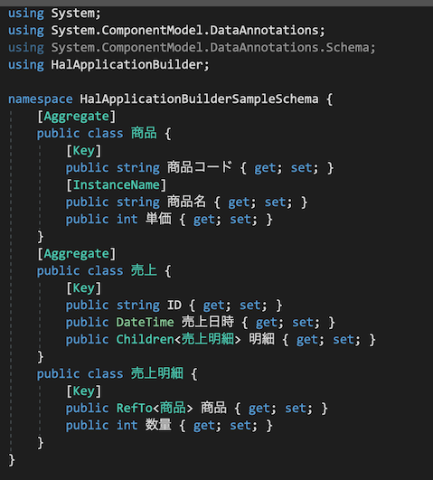
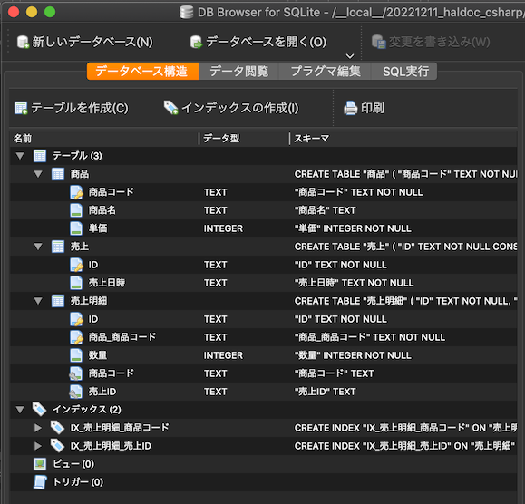
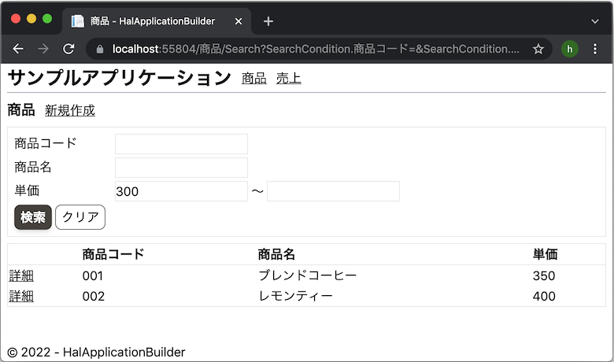
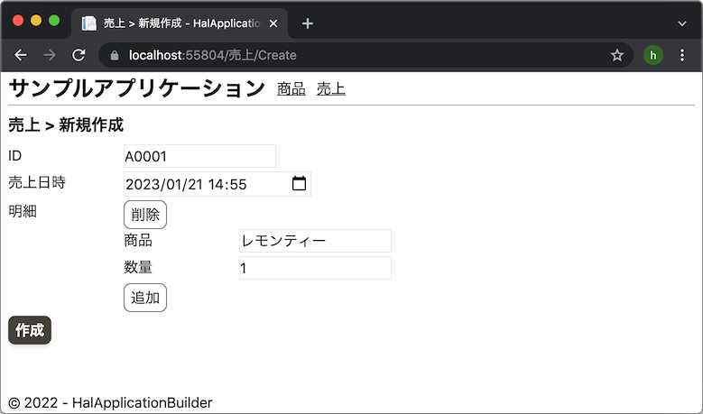

# :cherry_blossom: HalApplicationBuilder
データモデル駆動のローコードアプリケーション作成フレームワーク。

## 特徴
データ構造を定義するだけで、データベース定義や、それなりの画面を自動生成します。

例：定義されたデータ構造

↓

自動生成されたデータベース

自動生成された画面（一覧検索画面）

自動生成された画面（登録更新画面）

1対多の明細データや多様な型の子要素など、複雑なデータ構造を実現可能。

[スクラッチ開発に近い、ソースコードレベルのAPIを提供](#開発フロー)。高い拡張性。C#やSQLやHTMLを直接編集できる開発者向き。

---
## ドキュメント
### 開発フロー

### 1.プログラマが集約定義等を作成する

#### 属性

| 属性             | 設定対象             | 説明                                                                                               |
| :--------------- | :------------------- | :------------------------------------------------------------------------------------------------- |
| `[Aggregate]`    | クラス               | データの作成・更新・削除の単位となるクラスであることを表す。                                       |
| `[Key]`          | プロパティ           | プロパティがそのデータの主キーであることを表す。                                                   |
| `[InstanceName]` | プロパティ           | プロパティがそのデータの名称であることを表す。画面上に表示される名称にこのプロパティが使用される。 |
| `[Variation]`    | `Child<>` プロパティ | [バリエーション型子要素](#バリエーション型子要素)を参照。                                          |
| `[NotMapped]`    | プロパティ           | HalApplicationBuilderがソースの自動生成などで当該プロパティを無視するようになる                    |

#### プロパティに使用できる型

| 型           | 説明               |
| :----------- | :----------------- |
| `string`     | 文字列型。         |
| `bool`       | 真偽値。           |
| `int`        | 整数。             |
| `float`      | 浮動小数点。       |
| `decimal`    | 固定小数点。       |
| `DateTime`   | 日付時刻型。       |
| enum         | 列挙体。           |
| `Child<>`    | 子要素（単数）。   |
| `Children<>` | 子要素（複数）。   |
| `RefTo<>`    | 他データへの参照。 |

#### バリエーション型子要素
執筆中

### 2.HalApplicationBuilderが各種ソースを自動生成する
### 3.生成されたソースでは足りない画面や機能を一から作成する
### 4.DB定義を更新する
### 5.アプリケーション実行

---
## デバッグ方法
- スキーマを変更する（サンプルアプリの場合は `HalApplicationBuilderSampleSchema` を変更）
- ソース自動生成を実行する（サンプルアプリの場合は `HalApplicationBuilder` のProgram.cs実行）
- Tailwindのビルド（`HalApplicationBuilderSampleMvc` のルートディレクトリで `npm run buildcss` を実行）
- `HalApplicationBuilderSampleMvc` をデバッグ実行する
