# NijoApplicationBuilder - スキーマ駆動型アプリケーション生成フレームワーク
NijoApplicationBuilderは、XMLベースのスキーマ定義からアプリケーションコードの一部を自動生成するフレームワークです。
主として、特定の業務フローをサポートするためのアプリケーションのフルスクラッチ開発を補助することを主眼としています。

2025年現在のソフトウェアアーキテクチャは、複数の技術スタックを駆使してアプリケーションを組み上げることが一般的です。
例えば、RDBMSとWebを用いて住所録アプリケーションを作るとき、このアプリケーションで「氏名・住所・郵便番号・電話番号」という構造のデータを管理する必要があるとします。
ここで、RDBのテーブル定義、Webのフロントエンド、Webのバックエンドの全てで、この4項目をもったオブジェクトがそれぞれ定義され、かつそれらの構造は常に同期されている必要があります。

このフレームワークは、XMLベースのスキーマ定義をもとに、以下のソースコードを自動生成することで、
より品質の高いアプリケーションのスクラッチ開発をサポートすることができます。

- それぞれの技術スタックごとに適したオブジェクト構造定義（RDBMSのテーブル定義、C#のクラス、TypeScriptの型定義など）
- 必須入力チェックやORMのデータ構造定義など、スキーマ定義から一意に決まる処理

## 主な機能

- **スキーマ定義のパース**: nijo.xmlのスキーマ定義を読み込み、解析します。
  - ここでスキーマ定義内に矛盾がないかどうかの妥当性検証がおこなわれます。
- **コード生成**: 定義されたモデルから各種ソースコードを自動生成します。
  - コード生成前にスキーマ定義のパースが行なわれます。スキーマ定義にエラーがある場合はコードの自動生成は実行されません。

## 開発手順概要
このツールを用いてアプリケーションを開発する大まかな手順を説明します。

0. 初期設定
1. スキーマ定義を作成
2. コード自動生成を実行する
3. 自動生成で賄えない機能を自前で実装する



### 0. 初期設定
以下のコマンドを実行し、新しいアプリケーションを作成してください。

```cmd
cd <新しいアプリケーションのソースコードを配置したいフォルダ>
nijo.exe new
```

ここで作成されるのは、NijoApplicationBuilderが提供する標準のスキーマ定義と標準のアプリケーションテンプレートです。

- 標準のスキーマ定義 `nijo.xml` は、あなたが具体的にどのようなデータ構造を定義できるかのイメージをつかむためのものです。
  そのまま使用する必要は無いため、適宜書き換えてください。
- 標準のアプリケーションテンプレートでは、 React.js, ASP.NET Core, SQLite を用いた、動作する完全なアプリケーションを用意しています。
  あなたは必ずしもこのテンプレートを用いる必要はなく、ASP.NET Core と TypeScirpt を用いる技術スタックであれば任意の構成を使うことができます。
  RDBMSについては、 Entity Framework Core が対応可能なものであればそのまま利用できます。これはこのフレームワークではなく Entity Framework Core の制約です。
  JavaやKotlinやCOBOLなど、ここで用意されている言語以外での構造体定義が必要な場合、コード生成エンジンの方に改修を加える必要があるため、そのままでは使えません。

### 1. スキーマ定義を作成
開発を進めるにあたり、スキーマ定義が変更になることは頻繁に発生します。
その都度、 `nijo.xml` を書き換えてください。
詳細な仕様は [スキーマ定義仕様](./スキーマ定義仕様.md) を参照してください。

### 2. コード自動生成を実行する
`nijo generate` コマンドを実行し、コード自動生成を実行します。
以下はWindowsでのコマンド実行例です。 `<nijo.xmlがあるフォルダ>` の箇所は各自の環境に応じて読み替えてください。

```cmd
cd <nijo.xmlがあるフォルダ>
nijo.exe generate
```

このコマンドの実行により、当該アプリケーションにあるいくつかの `__AutoGenerated` という名前のフォルダ内に、ソースコードが自動生成されます。
なお、 `__AutoGenerated` 内のファイルは `generate` コマンド実行の度に毎回洗い替えられます。

### 3. 自動生成で賄えない機能を自前で実装する
当然ながらアプリケーションはデータ構造だけで完結することはできず、UI、データ構造から一意には決まらない制約、CI/CD用の仕組みなど、種々のカスタマイズを加える必要があります。
自動生成されたソースを利用しながら、アプリケーションとして必要な残りの部分を定義してください。

以上、1, 2, 3 のサイクルを繰り返しながら、アプリケーションを完成させていってください。

## プロジェクト構造
プロジェクトは以下の主要コンポーネントで構成されています。
また、主要なフォルダには `README.md` ファイルを配置しています。
そのフォルダに配置されているモジュールの責務や概要を把握するのに利用してください。

- [`Nijo/`](./Nijo/): コード生成エンジン。XMLスキーマ解析とコード生成を行ないます。
  - [Models](Nijo/Models/README.md) : スキーマ定義から生成される各種モデルの実装
  - [ValueMemberTypes](Nijo/ValueMemberTypes/README.md) : 標準データ型の定義
  - [SchemaParsing](Nijo/SchemaParsing/README.md) : nijo.xmlのパース処理に関する実装
  - その他の生成ロジック
- [`Nijo.ApplicationTemplate.Ver1/`](./Nijo.ApplicationTemplate.Ver1/): アプリケーションテンプレート。
- [`Nijo.IntegrationTest/`](./Nijo.IntegrationTest/): ソースコード自動生成処理のユニットテスト。
  - `DataPatterns/`: テスト用のデータパターン


## ライセンス
このプロジェクトは[LICENSE.txt](./LICENSE.txt)の条件の下で提供されています。

# TypeScript MCP

TypeScript版 MCP (Model Context Protocol) ツールは、AIエージェントがTypeScriptのプロジェクトに関するタスクの遂行の精度を上げるためのものです。

このツールは、.NET版MCPをTypeScriptに移植したもので、公式の [Model Context Protocol TypeScript SDK](https://github.com/modelcontextprotocol/typescript-sdk) を使用しています。

## 機能

- `find_definition`: TypeScriptファイル内の特定位置にあるシンボルの定義を検索します
- `find_references`: TypeScriptファイル内の特定位置にあるシンボルの参照を検索します
- `suggest_abstract_members`: TypeScriptファイル内のクラスが実装すべきインターフェースメンバーを提案します

## セットアップ

1. 必要なパッケージをインストールします:

```bash
npm install
```

2. `appsettings.json`ファイルを設定します:

```json
{
  "TypeScriptMcp": {
    "ProjectPath": "<TypeScriptプロジェクトの絶対パス>",
    "WorkDirectory": "work"
  }
}
```

## 使い方

### 開発モードで実行

```bash
npm run dev
```

### ビルドして実行

```bash
npm run build
npm start
```

## AI アシスタントとの連携

このツールは、[Model Context Protocol](https://github.com/modelcontextprotocol/typescript-sdk)に準拠しており、AIアシスタントと直接連携できます。StandardIO通信を使用するため、AIアシスタントからツールを直接呼び出すことができます。

## APIの使用例（非標準）

このツールはHTTP APIも提供していた以前の実装とは異なり、現在はModel Context Protocolの標準に従って実装されています。従来のHTTPインターフェースが必要な場合は、以下の実装を参考にしてください：

```typescript
import express from 'express';
import bodyParser from 'body-parser';
import { McpServer } from '@modelcontextprotocol/sdk/server/mcp.js';
import { StdioServerTransport } from '@modelcontextprotocol/sdk/server/stdio.js';

// Express APIサーバーを追加
const app = express();
app.use(bodyParser.json());

// MCP APIエンドポイント
app.post('/api/mcp', (req, res) => {
  try {
    const { tool, params } = req.body;
    // ここでMCPサーバーのツールを呼び出す処理を実装
    res.json({ result });
  } catch (error) {
    res.status(500).json({ error: error.message });
  }
});

app.listen(3000, () => {
  console.log('HTTPサーバーがポート3000で起動しました');
});
```
