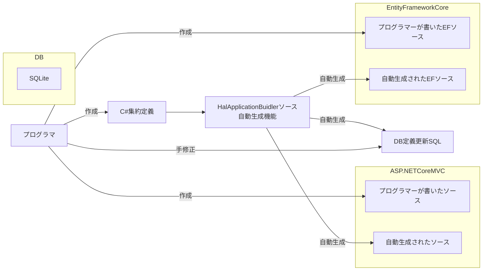

# :cherry_blossom: HalApplicationBuilder
## 対象範囲 scope
- 業務用のアプリケーションの開発（ex： 顧客管理、予実管理、生産管理、etc）
- その他、ブラウザの画面を使ってデータを入力したり参照したりするアプリケーションを作成したいという要求全般

## 動機 motivation
- フルスクラッチで様々な業務アプリの開発を構築してきた経験から、どの会社のアプリケーションでも毎度似たような課題や仕様や実装が繰り返し登場していることに気づいたため、その性質を抽象化して整理したい
- プログラマーがデータ構造を定義するだけで、それなりの画面やRDBが自動的に出来上がってほしい
- とはいえ、特に日次の定常業務で使われるような画面など、現場ユーザーの業務に合わせた高度なスクラッチ開発の柔軟性を捨てるわけには行かないので、スクラッチと同程度の拡張性をもった仕組みにしたい

## アーキテクチャ

## デバッグ方法
- スキーマを変更する（サンプルアプリの場合は `HalApplicationBuilderSampleSchema` を変更）
- ソース自動生成を実行する（サンプルアプリの場合は `HalApplicationBuilder` のProgram.cs実行）
- Tailwindのビルド（`HalApplicationBuilderSampleMvc` のルートディレクトリで `npm run buildcss` を実行）
- `HalApplicationBuilderSampleMvc` をデバッグ実行する
